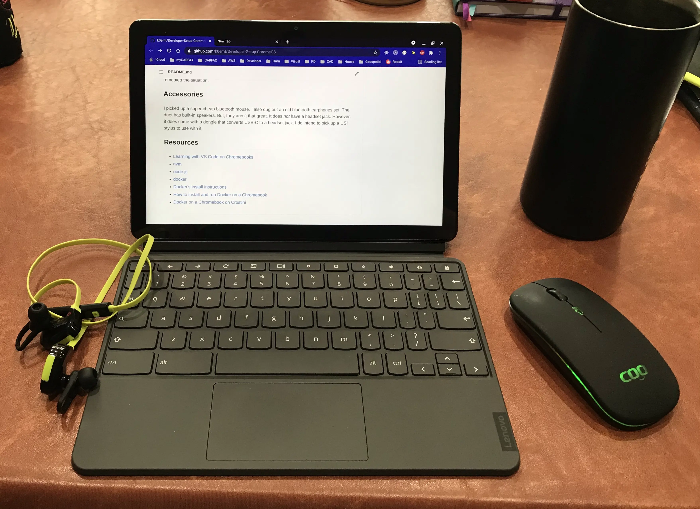

# Developer Setup ChromeOS

Experience reports are in my [engineering journal][1]

When this project started, I was getting started with setting up the Lenovo Duet ChromeOS tablet for developer use.
Subsequently, I've added information on the Lenovo Duet 3, ThinkPad C13 Yoga Chromebook and soon the Duet 3 Gen 9.

## Background

I haven't owned an Android device in some time.
I've never owned a ChromeOS device.
With the advent of the Linux(Beta) feature and coming across a Lenovo Duet on sale, it was time to explore this.
I've always been a fan of small devices and seeing what they can be pushed to do.  For example, I'm initiating this repo on an iPad mini with Bluetooth keyboard.

## Use Case

What's my use case?
I plan to revisit the Android ecosystem and check out the state of ChromeOS.
I am also very intrigued with the ability to run Linux apps.
It is my intent to use this device for a small amount of consumption and for Linux experimentation and development.
I appreciate experiential learning.

## System Configuration

### Enable Linux (Beta)

This was easily found in Settings -> Developers -> Linux development environment (Beta)

### Other settings

Discovered that you can view system information at <chrome://system>  Notable information includes:

- crostini for Linux container
- network_devices
- power_supply_info

## Applications

With a ChromeOS device you can have three different types of apps installed:

- Chrome apps which are web based applications
- Android applications (I understand that these run in a container)
- Linux apps

Use the web store for ChromeOS apps and extensions, the play store for android apps, and your command line (deb) for Linux apps.

## Resources

- [Learning with VS Code on Chromebooks][2]

[1]: Journal/
[2]: https://code.visualstudio.com/blogs/2020/12/03/chromebook-get-started
